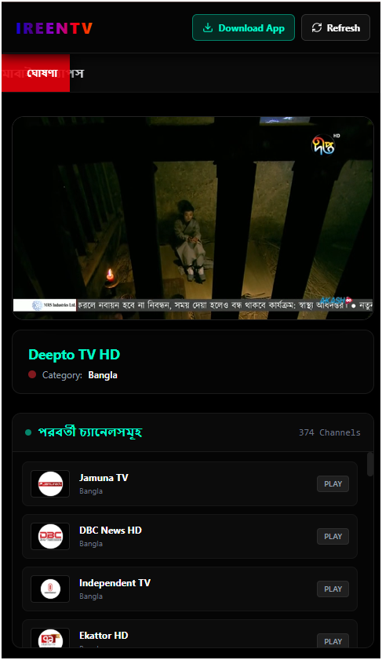
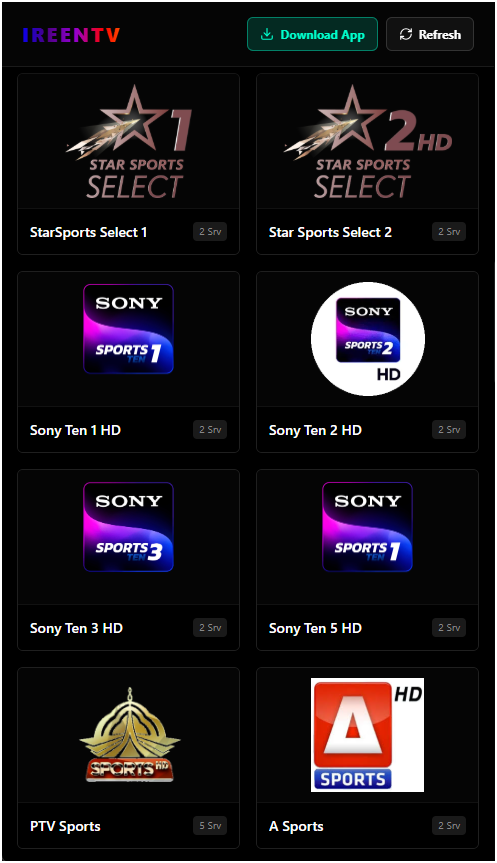
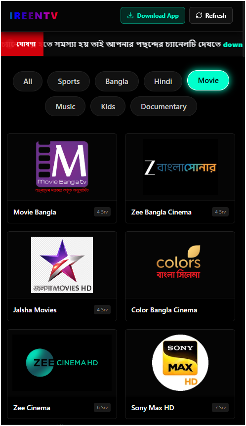
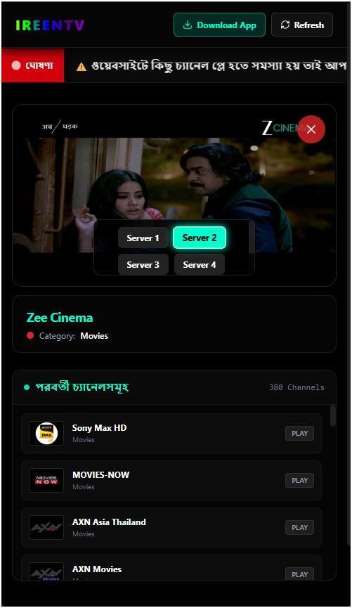

# 📺 IreenTV — Live Sports, Movies, Music & Bengali Entertainment

  

  <strong>বিনোদনের নতুন দিগন্ত — হোক আপনার প্রতিদিনের সঙ্গী!</strong>

  
  
  

  
  

---

## 🌟 Overview / ওভারভিউ

**IreenTV** is a state-of-the-art, high-performance Live IPTV Streaming application designed specifically for Bengali and International entertainment enthusiasts. Whether you want to enjoy high-stakes Live Sports, classic and blockbuster Movies, high-fidelity Music videos, or standard Bengali regional and news channels, IreenTV provides seamless, high-speed, and buffer-free viewing directly from your web browser, Android Smartphone, or Android Smart TV!

**IreenTV** একটি অত্যাধুনিক ও উচ্চ-গতির লাইভ আইপিটিভি (IPTV) স্ট্রিমিং প্ল্যাটফর্ম। এটি বিশেষভাবে বাংলা এবং আন্তর্জাতিক বিনোদনপ্রেমীদের জন্য তৈরি করা হয়েছে। যেকোনো ব্রাউজার, অ্যান্ড্রয়েড স্মার্টফোন বা অ্যান্ড্রয়েড স্মার্ট টিভি থেকে বাফারিং ছাড়াই সরাসরি লাইভ খেলাধুলা, ব্লকবাস্টার মুভি, এইচডি মিউজিক এবং খবরসহ সব চ্যানেল উপভোগ করুন একদম ফ্রিতে!

---

## 📸 Screenshots / স্ক্রিনশটসমূহ

> **🚨 গুরুত্বপূর্ণ টিপস (ইমেজ শো না করলে অবশ্যই পড়ুন):** 
> ১. **হুবহু বানানের মিল (Case Sensitivity):** গিটহাব কেস-সেন্সিটিভ (Case-sensitive)। অর্থাৎ আপনার ফাইলটির নাম যদি `screenshot1.PNG` (বড় হাতের) বা `screenshot1.jpg` হয়, তাহলে অবশ্যই নিচের কোডের নামের সাথে হুবহু মিল থাকতে হবে। আপনার ফাইলের এক্সটেনশন যদি `.jpg` বা `.jpeg` হয় তবে কোডে `.png` এর জায়গায় তা পরিবর্তন করে নিন।
> ২. **পাথের সঠিকতা:** নিচে `./assets/` ব্যবহার করা হয়েছে যা গিটহাবের জন্য সবচেয়ে নিরাপদ পাথ ফরম্যাট।

  

<table width="100%">
  <tr>
    <td width="50%">
      
<strong>📺 Live Stream & Channel List</strong>

      
    </td>
    <td width="50%">
      
<strong>📱 Category Wise Grid View</strong>

      
    </td>
  </tr>
  <tr>
    <td width="50%">
      
<strong>🎬 Movies Selection</strong>

      
    </td>
    <td width="50%">
      
<strong>🔄 Multi-Server Support</strong>

      
    </td>
  </tr>
</table>

---

## ⚡ Features / প্রধান বৈশিষ্ট্যসমূহ

- **📺 380+ Live Channels:** Stream extensive collections of Bangla, Hindi, English, and International TV channels.
- **⚽ Live Sports Streaming:** Never miss a match! Watch football, cricket, racing, and more in real-time.
- **🎬 On-Demand Movies:** Dedicated Movies & Series section with high-definition servers.
- **🔄 Multi-Server Technology:** Switch servers (Server 1, Server 2, Server 3, Server 4) instantly if one encounters high traffic or load.
- **📱 Dynamic Grid Layout:** Extremely responsive design works flawlessly on all display dimensions (Mobile, Tablet, Desktop, TV).
- **🚫 Zero Buffering:** Optimized streaming protocols designed to work perfectly even on low-bandwidth networks.
- **🇧🇩 Native Bengali UI Context:** Beautiful, easily navigable menu with clear Bengali descriptions.

---

## 📥 Downloads / ডাউনলোড লিংকসমূহ

Get the official, clean, and pre-compiled applications directly from the GitHub releases:

### 📱 1. Android Mobile App
Best optimized layout for smartphone portrait & landscape layouts. High touch target buttons and instant notifications.
* **Download APK:** [IreenTV Mobile.apk](https://github.com/ireentv/IreenTV-Mobile-Apps/raw/refs/heads/main/IreenTV%20Mobile.apk)

### 📺 2. Android Smart TV HD App
Optimized full-screen D-pad navigation support for Android TV, FireStick, and TV Boxes. Enjoy clean cinema views.
* **Download APK:** [Smart TV HD.apk](https://github.com/ireentv/Smart-TV-Apps/raw/refs/heads/main/Smart%20TV%20HD.apk)

### 🌐 3. Web Version
No installation required! Stream directly from any modern web browser.
* **Visit Site:** [ireentv.pages.dev](https://ireentv.pages.dev/)

---

## 🛠️ How to Install on Smart TV / স্মার্ট টিভিতে ইনস্টল করার নিয়ম

1. **Enable Unknown Sources:** Go to your TV's `Settings` -> `Security & Restrictions` -> enable **"Unknown Sources"**.
2. **Download APK:** Download the **[Smart TV HD.apk](https://github.com/ireentv/Smart-TV-Apps/raw/refs/heads/main/Smart%20TV%20HD.apk)** file onto a USB flash drive or use the "Downloader" app on your TV.
3. **Install:** Open your TV's file explorer, select the USB drive, click on the APK, and choose **Install**.
4. **Enjoy:** Launch IreenTV from your App Drawer and start streaming!

---

## 📢 Stay Connected / যোগাযোগ ও আপডেট

নতুন নতুন চ্যানেল যুক্ত করা, সার্ভার আপডেট এবং যেকোনো টেকনিক্যাল সাপোর্টের জন্য আমাদের অফিশিয়াল টেলিগ্রাম চ্যানেলে যুক্ত থাকুন:

* **Telegram Channel:** [Join IreenTV on Telegram 🚀](https://t.me/ireentv)

---

## 👨‍💻 About Developer / ডেভেলপার সম্পর্কিত তথ্য

**IreenTV** is proudly developed and maintained by **MD ANAMUL HOQUE**. For business queries, suggestions, feedback, or custom app development services, feel free to visit:

* **Developer Portfolio:** [anamul.pages.dev 🌐](https://anamul.pages.dev/)
* **Contact Developer Email:** 

---

### ⚖️ Disclaimer / দাবিত্যাগ
*This application operates as a media locator and visual wrapper. All video streams and links showcased inside IreenTV are publicly available across the internet. We do not host or store any video contents on our servers. For any copyright concerns, please contact the respective media host.*

*আইরিন টিভি একটি মিডিয়া লোকেটর ও ভিজ্যুয়াল র্যাপার হিসেবে কাজ করে। অ্যাপে প্রদর্শিত সকল ভিডিও স্ট্রিম বা লিংক ইন্টারনেটের উন্মুক্ত উৎস হতে সংগৃহীত। আমরা আমাদের সার্ভারে কোনো ফাইল বা ভিডিও হোস্ট করি না।*

---

Made with ❤️ by MD ANAMUL HOQUE | Copyright © 2026 IreenTV

